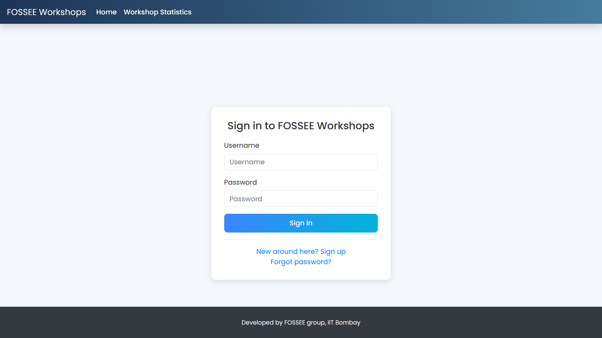
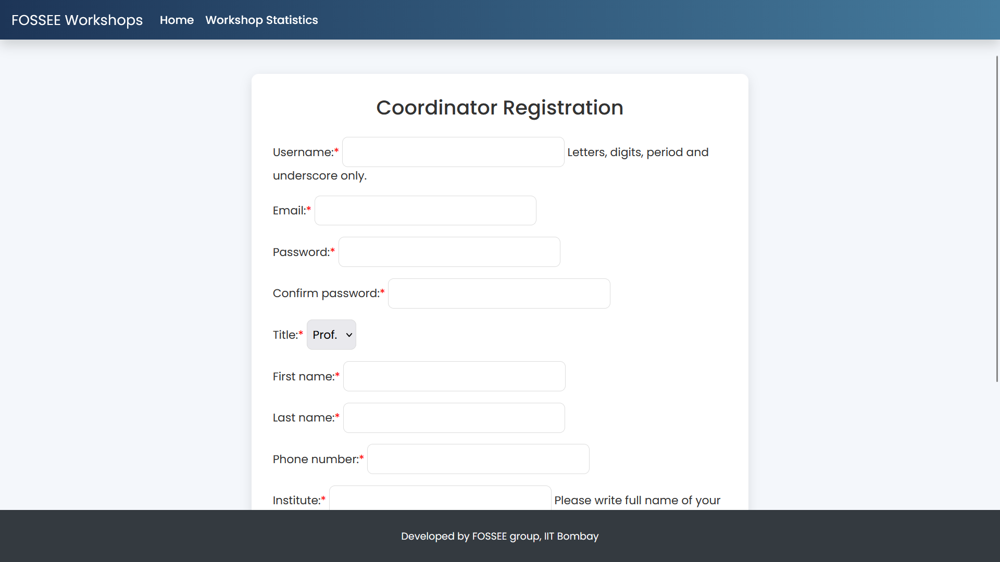
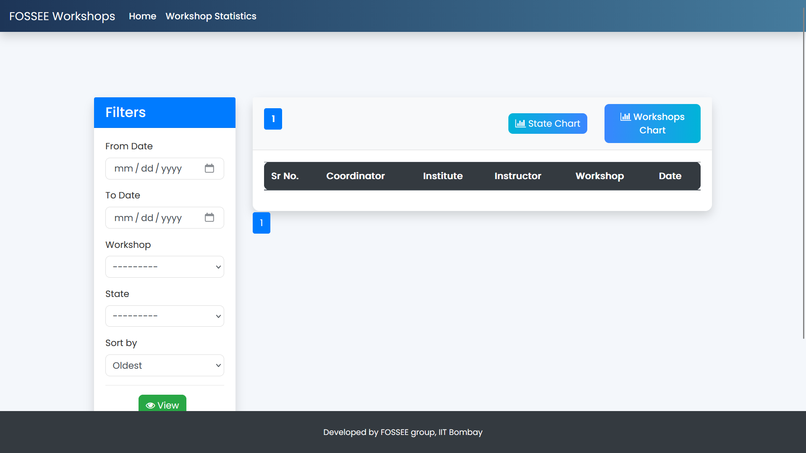

# Workshop Booking System

A web platform where **coordinators can book workshops** conducted by instructors.

Coordinators can:

- Register for **existing instructor workshops**
- **Propose workshop dates** based on availability

The platform helps instructors manage workshops while providing useful **statistics and analytics**.

---

# Features

## Workshop Statistics

### Instructor Access
Available only for instructors:

- Monthly workshop count
- Instructor / Coordinator profile statistics
- Upcoming workshops
- Comment system on coordinator profiles

### Public Access
Available to everyone:

- Workshops displayed on **Map of India**
- **Pie chart visualization** of workshop types
- Public statistics dashboard

---

# Workshop Management

Instructors can manage workshop requests by:

- Accepting workshop requests
- Rejecting workshop requests
- Deleting workshops
- Postponing workshops based on coordinator requests

---

# UI/UX Enhancements

This project includes **UI improvements** to enhance user experience:

- Modernized login page
- Improved registration form layout
- Statistics dashboard redesign
- Filter panel improvements
- Responsive tables
- Gradient navbar and buttons
- Better form field styling

---

# Screenshots

## Login Page



---

## Registration Page



---

## Workshop Statistics Dashboard



---

# Technologies Used

- Python
- Django
- HTML
- CSS
- Bootstrap
- JavaScript
- Chart.js

---

# Installation

Clone the repository

```bash
git clone https://github.com/Kapish17/UI-UX-Enhancement.git